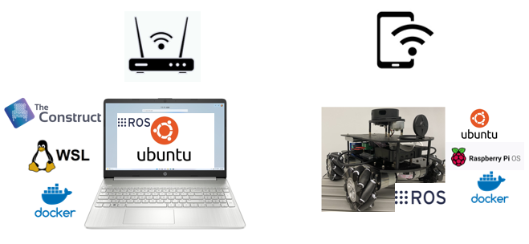

# **ROS environment setup**

The rUBot mecanum robot we will work is represented in the picture:

His main characteristics are: 

- RaspberryPi4 computer onboard control with Ubuntu20 and ROS Noetic
  - RPlidar distance sensor
  - usb camera sensor
- Arduino MEGA with shield for sensors & actuators control
  - Servomotor actuators for the 4 mecanum wheels
  


The main objectives of this chapter are:

- Real rUBot setup
- ROS environment setup

You can see graphically the rUBot system setup



We will use TheConstruct environment to:
- Control the rUBot model in virtual environment
- Control the real rUBot in real environment
- Update and syncronize the "rUBot_mecanum_ws" repository project

## **1. Control the rUBot model in virtual environment**

To **setup the repository** in your ROS environment, you need to:
- Fork my repository (https://github.com/manelpuig/rUBot_mecanum_ws) in your github account
- Open your ROS Noetic environment: https://app.theconstructsim.com/
- Clone your forked directory in your home directory
  ```shell
  cd /home/user
  git clone https://github.com/your_username/rUBot_mecanum_ws
  cd rUBot_mecanum_ws
  catkin_make
  ```
- Open .bashrc and ensure that you have the last 2 lines (review the exact name of your repository):
  ```shell
  source /opt/ros/noetic/setup.bash
  source /home/user/rUBot_mecanum_ws/devel/setup.bash
  ```
You are ready to work with your repository and control the rUBot model in virtual environment!

## **2. Control the real rUBot in real environment**

when you turn on the robot:
- The rUBot connects automatically to a Public "Robotics_UB" Network with a mobile Hotspot.
- Each robot has a Hostname: rUBot_0x
- The static IP assigned to each robot is: 192.168.0.x0
- a "bringup" service is started on boot and the robot is ready to be used 
- each rUBot is registered to the RRL service (Real Robot Lab) from TheConstruct ROS environment (https://www.theconstruct.ai/help/how-do-i-connect-my-own-robot-to-the-construct/)
- Open Your ROSject in "My Rosjects" section
- In the bottom menu select "Connect to your real Robot"
- You will be ready to control the real robot:
  - The bringup is already made in the real robot on boot
  - all the launch files you start on therminal will be executed in the real robot
  - before exit remember to "Disconnect" from your real robot
- before exit the rosject remember to syncronize your repository!

## **3. Update and syncronize the "rUBot_mecanum_ws" repository project**

The objective is to update the changes you have made, when working in ROS environment, in your github repository.

- Access to the TheConstruct environment local repository:
  ````shell
  cd /home/user/rUBot_mecanum_ws
  ````
- Update the local repository with possible changes in github origin repository
  ````shell
  git pull
  ````
- You can work with your local repository for the speciffic project session
- Once you have finished and you want to syncronize the changes you have made and update the github origin repository, type:
  ````shell
  git add .
  git commit -m "Message"
  git push
  ````
- When you will Push them, the first time you will be asked to link the repository to your github account:
- Open a terminal in and type the first time:
  ```shell
  git config --global user.email "mail@alumnes.ub.edu"
  git config --global user.name "your github username"
  ```
- for succesive times, you only need to select changes, Commit a message and Push
- You will have to specify the Username and Password (Personal Access Token you have generated)

To obtain the **PAT** in github follow the instructions:

  - Log in to GitHub
  - Go to Developer Settings
  - Select Access Personal Access Tokens: Choose Tokens (classic)
  - Click Generate new token (classic) and configure it:
    - Add a note to describe the purpose of the token, e.g., "ROS repo sync."
    - Set the expiration (e.g., 30 days, 60 days, or no expiration).
    - Under Scopes, select the permissions required:
      - For repository sync, you usually need: repo (full control of private repositories)
    - Click Generate token
  - Once the token is generated, copy it immediately. You won't be able to see it again after leaving the page.

Your github origin repository has been updated!
