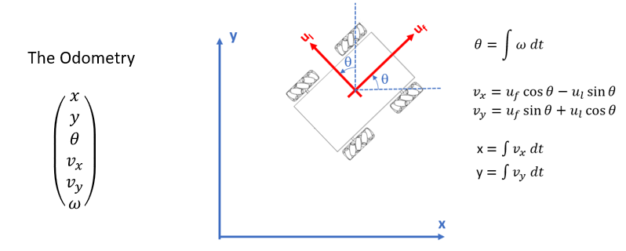
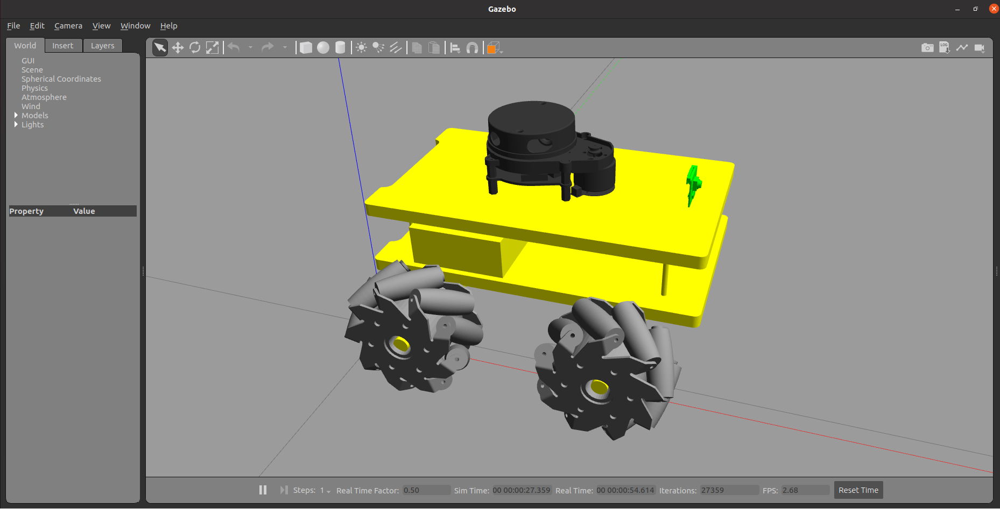
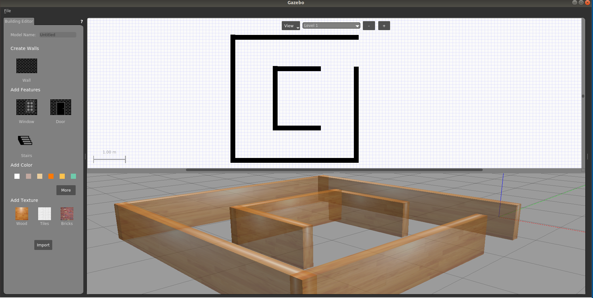
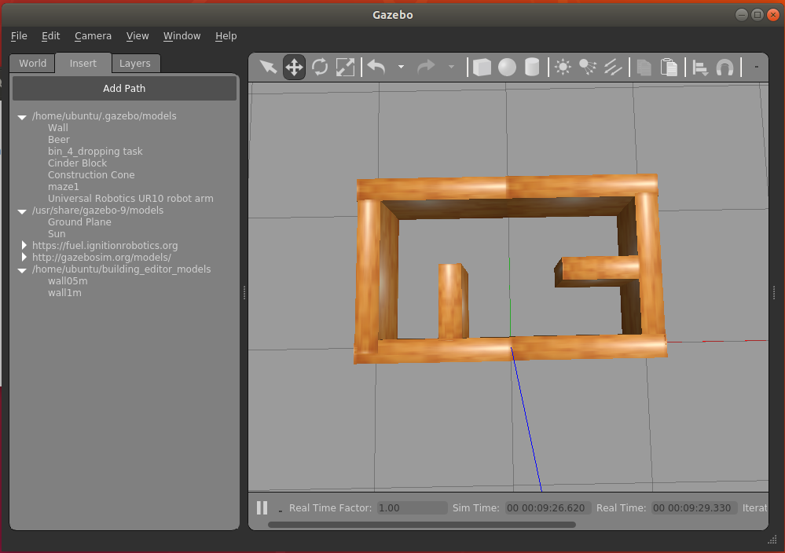
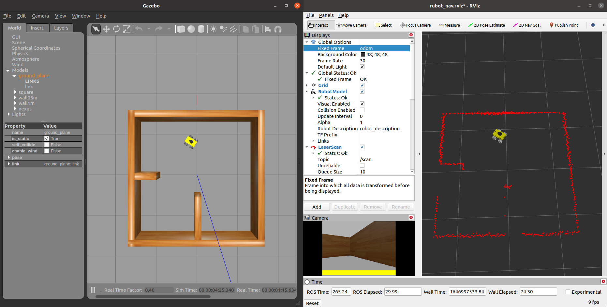

# **rUBot mecanum Bringup**

The objectives of this chapter are:
- Create a robot model of our rUBot mecanum
- Create a world model of the virtual environment
- Bringup the robot in virtual environment
- Bringup the real robot.

The rUBot mecanum robot we will work is represented in the picture:


**Bibliography:**
- https://bitbucket.org/theconstructcore/workspace/projects/PS

## **1. rUBot mecanum model generation**

First of all, we have created the "rubot_mecanum_description" package where we have created the rUBot model. 

In case you want to create it from scratch, type:
```shell
cd ~/home/user/rubot_mecanum_ws/src
catkin_create_pkg rubot_mecanum_description rospy
cd ..
catkin_make
```
Then open the .bashrc file and verify the environment variables and source to the proper workspace:
```shell
source ~/home/user/rubot_mecanum_ws/devel/setup.bash
```
### **1.1. Model design**

The geometrical definition of our rUBot is graphically described by:


The different elements (named **links**) are:
- base_footprint
- base_link
- wheels
- camera
- base_scan
- part

These elements are connected each-other by **joints**:
- base_link_joint
- wheel_joint
- joint_camera
- scan_joint
- joint_part

Some of these links have a speciffic **functionalities**:
- wheels: perform a robot movement according to a Mecanum-drive kinematics
- camera: view front images
- base_scan: detect obstacle distances in 360º around the robot

To create our robot model, we use **URDF files** (Unified Robot Description Format). URDF file is an XML format file for representing a robot model.(http://wiki.ros.org/urdf/Tutorials)

The general structure of a robot urdf model is based on:
- Links and joints: for the geometrical structure
- Gazebo plugins: for the functionalities

The urdf file structure is:
```xml
<?xml version="1.0" encoding="utf-8"?>
<robot name="rubot">
  <link name="base_link">
  ...
  </link>
  <joint name="base_link_joint" type="fixed">
  ...
  </joint>
  <gazebo>
    <plugin name="Mecanum_controller" filename="libgazebo_ros_planar_move.so">
    ...
    </plugin>
  </gazebo>
  <gazebo reference="upper_left_wheel">
  ...
  </gazebo>
</robot>
```

We have created 2 folders for model description:
- URDF: folder where different URDF models are located. In our case rubot.urdf
- meshes: folder where 3D body models in stl format are located. We will have rubot folder.

As we have explained above, main parts of URDF model are:
- links: diferent bodies/plastic elements
- joints: connection between 2 links 
- sensors & actuators plugins (2D camera, LIDAR and 4-wheels mecanum-drive)

The **link definition** contains:
- visual properties: the origin, geometry and material
- collision properties: the origin and geomnetry
- inertial properties: the origin, mass and inertia matrix

The **joint definition** contains:
- joint Type (fixed, continuous)
- parent and child frames
- origin frame
- rotation axis

In the case or upper left wheel link:
```xml
<!-- upper_left_wheel -->
  <link name="upper_left_wheel">
    <visual>
      <origin rpy="0 0 0" xyz="0 0 0"/>
      <geometry>
        <mesh filename="package://rubot_mecanum_description/meshes/rubot/upper_left_wheel.stl" scale="0.001 0.001 0.001"/>
      </geometry>
      <material name="light_grey"/>
    </visual>
    <collision>
      <origin rpy="-1.57 0 0" xyz="0 0 0"/>
      <geometry>
        <cylinder length="0.03" radius="0.05"/>
      </geometry>
    </collision>
    <inertial>
      <origin rpy="-1.57 0 0" xyz="0.0 0.0 0.0"/>
      <mass value="0.2"/>
      <inertia ixx="0.000166" ixy="0" ixz="0" iyy="0.000303" iyz="0" izz="0.000166"/>
    </inertial>
  </link>
  <joint name="upper_left_wheel_joint" type="continuous">
    <origin rpy="0 0 0" xyz="0.07 0.1 0"/>
    <parent link="base_link"/>
    <child link="upper_left_wheel"/>
    <axis xyz="0 1 0"/>
  </joint>
```
> Be careful with base_link:
>
> The inertia matrix can be analytically calculated with the mas and geometry. Be sure the mass is consistent and the inertia Ixx,Iyy and Izz are high enough to avoid underired drift movements. Consider the Inertia matrix you can generate using the **urdf_inertial_calculator.py** program file you have in "Documentation/files/Doc/Robot_Models/URDF_inertial".

The rUBot model includes different **sensors and actuators**:

The full model contains also information about the sensor and actuator controllers using specific **Gazebo plugins** (http://gazebosim.org/tutorials?tut=ros_gzplugins#Tutorial:UsingGazebopluginswithROS). 

Gazebo plugins give your URDF models greater functionality and compatible with ROS messages and service calls for sensor output and motor input. 

These plugins can be referenced through a URDF file, and to insert them in the URDF file, you have to follow the sintax:

**2D-camera Sensor**:

The two-dimensional camera sensor correspondas to the USB real camera. 

This camera obtains 2D images in the front and is simulated in URDF model as:
- link with the visual, collision and inertial properties
- joint of fixed type
- Gazebo plugin as a sort of "driver" to simulate the real behaviour

Review the joint and link definition in URDF model.

The used Gazebo plugin is:

```xml
  <!-- 2D Camera controller -->
  <gazebo reference="camera">
    <sensor name="camera1" type="camera">
      <update_rate>30.0</update_rate>
      <camera name="front">
        <horizontal_fov>1.3962634</horizontal_fov>
        <image>
          <width>800</width>
          <height>800</height>
          <format>R8G8B8</format>
        </image>
        <clip>
          <near>0.02</near>
          <far>300</far>
        </clip>
      </camera>
      <plugin filename="libgazebo_ros_camera.so" name="camera_controller">
        <alwaysOn>true</alwaysOn>
        <visualize>true</visualize>
        <cameraName>rubot/camera1</cameraName>
        <imageTopicName>image_raw</imageTopicName>
        <cameraInfoTopicName>camera_info</cameraInfoTopicName>
        <frameName>camera</frameName>
        <hackBaseline>0.07</hackBaseline>
        <distortionK1>0.0</distortionK1>
        <distortionK2>0.0</distortionK2>
        <distortionK3>0.0</distortionK3>
        <distortionT1>0.0</distortionT1>
        <distortionT2>0.0</distortionT2>
      </plugin>
    </sensor>
  </gazebo>
  ```
>To view the camera image you can:
> - add the line in the plugin 
> ```xml
><visualize>true</visualize>"
> ```
> - use rviz
> - type rqt in a terminal and select Plugins->Visualization->Image View
>
>Alternativelly with false in plugin, you can allways call the image typing in a new terminal:
>```shell
>rqt image view
>```

**RPlidar sensor**

A Lidar sensors is  device that is able to measure the obstacle distances at 360º around the robot. 

He is sending 720 laser beams (2 beams/degree) and measures the distance each laser beam finds an obstacle. He is able to measure from 12cm to 3m. The used Lidar sensor is a 360º RPLidar A1M8 (https://www.robotshop.com/es/es/rplidar-a1m8-kit-desarrollo-escaner-laser-360-grados.html)

This lidar is simulated in URDF model as:
- link with the visual, collision and inertial properties
- joint of fixed type
- Gazebo plugin as a sort of "driver" to simulate the real behaviour

 Review the joint and link definition in URDF model.
> Note that rpLIDAR is mounted at 180º and you need to turn the link model and the joint to reflect this in the URDF model.


The gazebo plugin we have used is:
```xml
  <!-- Laser Distance Sensor YDLIDAR X4 controller-->
  <gazebo reference="base_scan">
    <sensor name="lds_lfcd_sensor" type="ray">
      <pose>0 0 0 0 0 0</pose>
      <visualize>true</visualize>
      <update_rate>5</update_rate>
      <ray>
        <scan>
          <horizontal>
            <samples>720</samples>
            <resolution>1</resolution>
            <min_angle>0.0</min_angle>
            <max_angle>6.28319</max_angle>
          </horizontal>
        </scan>
        <range>
          <min>0.12</min>
          <max>10</max>
          <resolution>0.015</resolution>
        </range>
        <noise>
          <type>gaussian</type>
          <!-- Noise parameters based on published spec for YDLIDAR X4
              is 1.5% at half range 4m (= 60mm, "+-160mm" accuracy at max. range 8m).
              A mean of 0.0m and stddev of 0.020m will put 99.7% of samples
              within 0.16m of the true reading. -->
          <mean>0.0</mean>
          <stddev>0.02</stddev>
        </noise>
      </ray>
      <plugin filename="libgazebo_ros_laser.so" name="gazebo_ros_lds_lfcd_controller">
        <!-- topicName>/gopigo/scan</topicName -->
        <topicName>scan</topicName>
        <frameName>base_scan</frameName>
      </plugin>
    </sensor>
  </gazebo>
```
>To view the LIDAR rays be sure to add 
> ```xml
><visualize>true</visualize>"
> ```
> or use rviz

It is important to note that:
- the number of points of real RPLidar depends on Lidar model (you will need tot test it first)
- the number of points of simulated Lidar is selected to 720

**Actuator**:

The rUBot_mecanum contains a "Mecanum drive actuator" based on:
- 4 wheels driven by a DC servomotor 
- with speciffic Kinematic control 
- able to move the robot in x and y directions
- and able to obtain the Odometry information

Each of the 4 wheels have speciffic:
- link with the visual, collision and inertial properties
- joint of continuous type
- Gazebo plugin as a sort of "driver" to simulate the Kinematics of our rUBot_mecanum.

The **rUBot_mecanum kinematics** describes the relationship between the robot wheel speeds and the robot velocity. We have to distinguish:
- **Forward kinematics**: obtains the robot velocity (linear and angular in /cmd_vel) and POSE (odometry) for speciffic robot wheel speeds
- **Inverse kinematics**: obtains the robot wheels speeds for a desired robot velocity (linear and angular in /cmd_vel)

The different movements the Mecanum robot is able to perform are:


The forward kinematics is described by:


The inverse kinematics is described by:


The Odometry calculation is obtained by:



This kinematics and odometry calculations are described in the "libgazebo_ros_planar_move.so" file and the URDF model will contain the specific gazebo plugin.

This driver is the "Planar Move Plugin" and is described in Gazebo tutorials: http://gazebosim.org/tutorials?tut=ros_gzplugins#AddingaModelPlugin

```xml
  <!-- Mecanum drive controller -->
  <gazebo>
    <plugin name="Mecanum_controller" filename="libgazebo_ros_planar_move.so">
      <commandTopic>cmd_vel</commandTopic>
      <odometryTopic>odom</odometryTopic>
      <odometryFrame>odom</odometryFrame>
      <odometryRate>50.0</odometryRate>
      <robotBaseFrame>base_footprint</robotBaseFrame>
    </plugin>
  </gazebo>
  ```

### **1.2. ROS visualization Tools**

ROS has two powerfull visualization tools:
- RVIZ: used to visualize the robot model and the messages published in the different topics
- Gazebo: is a physical simulator 

**RVIZ**

We will first use RVIZ to check that the model is properly built. 

RViz only represents the robot visual features. You have available all the options to check every aspect of the appearance of the model.

We use a specific "display.launch" launch file where we specify the robot model we want to open in rviz with a configuration specified in "urdf.rviz":
```xml
<launch>
  <param name="robot_description" textfile="$(find rubot_mecanum_description)/urdf/rubot.urdf" />
  <node name="joint_state_publisher" pkg="joint_state_publisher" type="joint_state_publisher" />

  <node name="robot_state_publisher" pkg="robot_state_publisher" type="robot_state_publisher" />
  <node name="rviz" pkg="rviz" type="rviz" args="-d $(find rubot_mecanum_description)/rviz/urdf_final.rviz" />
</launch>
```
```shell
roslaunch rubot_mecanum_description display.launch
```


> Colors in rviz: 
>- are defined at the beginning
>- Ensure the "visual" link properties have color "name"
```xml
<robot name="rubot">
  <material name="yellow">
    <color rgba="0.8 0.8 0.0 1.0"/>
  </material>

  ...

    <link name="base_link">
    <visual>
      <origin rpy="0 0 0" xyz="0 0 0"/>
      <geometry>
        <mesh filename="package://rubot_mecanum_description/meshes/rubot/base_link.stl" scale="0.001 0.001 0.001"/>
      </geometry>
      <material name="yellow"/>
    </visual>
```
**Gazebo**

In robotics research, always before working with a real robot, we simulate the robot behaviour in a virtual environment close to the real one. **Gazebo** is an open source 3D robotics simulator and includes an ODE physics engine and OpenGL rendering, and supports code integration for closed-loop control in robot drives. This is sensor simulation and actuator control.

We will create a new spawn.launch file to spawn the robot in an empty world:
```xml
<launch>
  <!-- Define the needed parameters -->
  <arg name="model" default="rubot.urdf" />

  <include file="$(find gazebo_ros)/launch/empty_world.launch"/>
  <!-- Spawn the robot -->
  <!-- Robot URDF definition -->
    <param name="robot_description" textfile="$(find rubot_mecanum_description)/urdf/$(arg model)"/>
  <node name="spawn_model" pkg="gazebo_ros" type="spawn_model"
    args="-urdf -model rUBot -param robot_description"/>
</launch>
```
Open a new terminal and launch this file:
```shell
roslaunch rubot_mecanum_description rubot_gazebo.launch
roslaunch rubot_mecanum_description display.launch
```


You will see in Rviz the camera is receiving now images!
> Colors in gazebo: 
>- are defined at the end of urdf file:
```xml
<!-- Gazebo colors have to be specified here with predefined Gazebo colors -->
  <gazebo reference="base_link">
    <material>Gazebo/Yellow</material>
  </gazebo>
```
You can create a very **simple world** "rubot.world" using gazebo:

- Maintain the Gazebo and RVIZ screens opened
- add some objects in the empty world

Now in RVIZ you will see the objects with the USB camera and Lidar


You can see the nodes and topics generated using rqt_graph


> To see the frames you have to add TF in rviz

>Carefull:
- Perhaps is needed to setup your Keys again:
  ```shell
  curl -s https://raw.githubusercontent.com/ros/rosdistro/master/ros.asc | sudo apt-key add -
  sudo apt get update
  sudo apt get upgrade
  ```
- To close the Gazebo is better to type in a new terminal:
  ```shell
  pkill gzserver && pkill gzclient
  ```

**Activity:**

Design a proper model corresponding to the real rUBot_mecanum you will work with:
- Customized model colors (rviz and gazebo)
- Add a 3D-part on top with a fixed joint

To verify the final frame orientations (modify the launch files accordingly):
```shell
roslaunch rubot_mecanum_description rubot_gazebo.launch
roslaunch rubot_mecanum_description display.launch
```


## **2. Design the project world**

Here we have first to design the project world, for exemple a maze from where our rUBot mecanum has to navigate autonomously.

There is a very useful and simple tool to design a proper world: "**Building editor**" in gazebo.

Open gazebo as superuser:
```shell
sudo gazebo
```

You can build your world using "Building Editor" in Edit menu



- Save the generated model in a model folder (without extension)
- Close the Builder Editor, modify the model position and add other elements if needed.
- Save the generated world (with extension .world) in the world folder.

Once you finish is better to close the terminal you have work as superuser

#### ***Modify a created world***
- Open a terminal where you have the world you want to modify
- type: sudo gazebo ./test.world (or simply "gazebo test.world")
- make modifications
- save your world in a world directory
- close gazebo and the terminal
#### **Create world with model parts**
You can create model parts like walls of 90cm or 60cm or 20cm with a geometry and color, using building editor. These parts can be saved:
- in ~/.gazebo/models/
- in speciffic folder in your package (i.e. rubot_mecanum_ws/src/rubot_mecanum_description/models). To add the path in Gazebo, add this line in .bashrc file:
  ```xml
  export GAZEBO_MODEL_PATH=/home/user/rubot_mecanum_ws/src/rubot_mecanum_description/models:$GAZEBO_MODEL_PATH
  ```
- When a model is created with "Building Editor", this path is saved in gazebo environment and you can use it in the future.
- You can allways select "Add folder path" in "insert" gazebo menu tab, and select the models folder you have created in your project ws 

You will have acces in gazebo insert section. Then you can construct your world adding parts.

This is an exemple:



## **3. Bringup the rUBot in Virtual environment**

The first step in robotics is to bringup the rUBot mecanum robot in our generated world. This means:
- spawn our robot in the designed environment 
- and opened Rviz to see the topic messages.
``` shell
roslaunch rubot_mecanum_description rubot_bringup_sw.launch
```


>Careful:
- we have included in launch file: gazebo spawn, rviz visualization and rubot_nav node execution 
- Verify in rviz you have to change the fixed frame to "odom" frame

Now we are ready to control our robot in this virtual environment!

**Activity:**

Design a proper **world** corresponding to the real world you will work with:
- wooden parts with speciffic dimensions we have in the lab
- Propose a maze for all the next laboratory sessions

Generate the **bringup file** to spawn your previous designed robot model in the proposed maze.


## **4. Bringup the real robot**

The rUBot Mecanum real hardware is based on:
- Arduino Mega with custom Shield to control the 4 Mecanum Wheels (and other sensors onboard in function of the application)
- 2D-Camera to generate front images
- Lidar for Navigation with obstacle avoidance

To Bingup our real robot we have to:
 
- Launch the "Mecanum-drive control" module for servomotor actuators for the 4 mecanum wheels
- Launch the RPlidar distance sensor
- Launch the usb camera sensor


### **4.1. Launch the "Mecanum-drive control" module**

We have created a custom Arduino program for rubot_mecanum robot. This program is able to:
- Communicate with ROS environment to subscribe the desired rUBot movement
- Apply the kinematics of the Mecanum robot to control the 4 mecanum wheels 
- Read the encoders to calculate the odometry
- Communicate with ROS environment to publish the odometry in real-time
- Interface with all the other sensors/actuators connected to arduino-mega board

The "**rUBot_drive.ino**" arduino program is located on /Documentation/files/arduino/ folder

Let's see some important characteristics:
- You need to install Encoder.h lib: https://www.arduino.cc/reference/en/libraries/encoder/
- Motor connections


- Shield schematics


- Pin number of encoders, PWM and DIR in config.h and encoder.h files


- We need to increase the buffer size of /odom publisher because the Arduino MEGA Buffer size for messages is 512bits (not enough for Odometry messages). To perform this modification, in **ROS.h** file from the Arduino library you have to add (at the end in else case section):
  ```python
  #else

    //typedef NodeHandle_<ArduinoHardware, 25, 25, 512, 512, FlashReadOutBuffer_> NodeHandle;
    typedef NodeHandle_<ArduinoHardware, 5, 5, 1024, 1024, FlashReadOutBuffer_> NodeHandle;

  #endif  
  ```

- We need to increase the communication baudrate. The default baudrate to communicate with Arduino board is 57600. I suggest to maintain the Baudrate to 57600!
  >
  >In some cases is necessary to increase it. To increase this baudrate you need in **ArduinoHardware.h** file from the Arduino >library to change this default baudrate:
  ```python
  class ArduinoHardware {
    public:
      //ArduinoHardware(SERIAL_CLASS* io , long baud= 57600){
      ArduinoHardware(SERIAL_CLASS* io , long baud= 115200){
        iostream = io;
        baud_ = baud;
      }
      ArduinoHardware()
      {
  #if defined(USBCON) and !(defined(USE_USBCON))
        /* Leonardo support */
        iostream = &Serial1;
  #elif defined(USE_TEENSY_HW_SERIAL) or defined(USE_STM32_HW_SERIAL)
        iostream = &Serial1;
  #else
        iostream = &Serial;
  #endif
        //baud_ = 57600;
        baud_ = 115200;
      }
  ```
  > Important!: This changes have to be made in the library files where Arduino is installed (/home/arduino/libraries). This can be found when in arduino IDLE we go to settings to see the Exemples folder.

When we power the arduino board, this program starts and a to integrate this new node in the ROS environment, we have to run:
```xml
<node name="serial_node" pkg="rosserial_python" type="serial_node.py">
  <param name="port" type="string" value="/dev/ttyACM0"/>
  <param name="baud" type="int" value="57600"/>
</node>
```

### **4.2. Launch LIDAR node**

To launch the rpLIDAR sensor, connect the LIDAR sensor to rock5b and execute:
```shell
roslaunch rubot_mecanum_description rplidar_rock.launch
```
Verify:
- the port to: /dev/ttyUSB0
- the frame_id to: base_scan

## **3. Launch usb_cam node**
We have created a speciffic launch file to open properly the camera
To launch the raspicam sensor, execute:
```shell
roslaunch rubot_mecanum_description usb_cam_rock.launch
```
Verify:
- the video_device param to: "/dev/video1"
- the camera_frame_id param to: "usb_cam"
- the topic to subscribe to the image data:
  ```shell
  <remap from="image" to="/usb_cam/image_raw"/>
  ```
  > This is in case you want to open "Image View". By default is not activated (commented)

## **Final bringup launch file**

We will create a "rubot_bringup_hw_rock.launch" file to setup the rUBot_mecanum.

To launch the bringup file type:
```shell
roslaunch rubot_mecanum_description rubot_bringup_hw_rock.launch
```
Graphically we have this structure:


### **Activity**

The firsts tests we can do are:
- Image view in rviz
- lidar ranges
- Kinematics: wheels movement for desired direction
- odometry values
- DC motor linear velocity and position

## **1. Image view**

To view the image is better to use:
```shell
rqt_image_view
```
> This is usually done in the bringup file

## **2. Lidar reference frame and ranges**
The LIDAR reference-frame is by default "**base_scan**". When using rplidar mounted back-side, the urdf model is made with the "base_scan" frame looking to the back-side. As a consequence, in rviz we will see the obstacles 180º shifted.

The node programs we have made in package "rubot_control" takes into account that the zero-angle is in the back. This means we have noting to change if we want to use these nodes.

In the next section when we will work with SLAN techniques for navigation, we will have to make a correction to see the obstacles in the correct orientation. You will have to change the Lidar reference-frame to "**odom**" frame. You will have to open the "rplidar_rock.launch" file and change the line:
```xml
<param name="frame_id" type="string" value="base_scan"/>
```
to the param value:
```xml
<param name="frame_id" type="string" value="odom"/>
```
With this correction, once you have made the bringup, verify in RVIZ that the obstacles detected by laser beams are in the correct orientation!

In function of lidar module, there are 720 or more laser beams.
We have created a "rubot_lidar_test.launch" file to test the number of laser beams and its position.
```shell
roslaunch rubot_control rubot_lidar_test.launch
```
