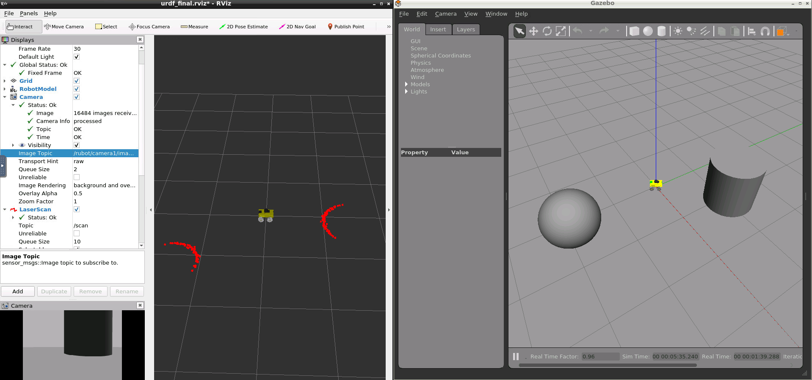
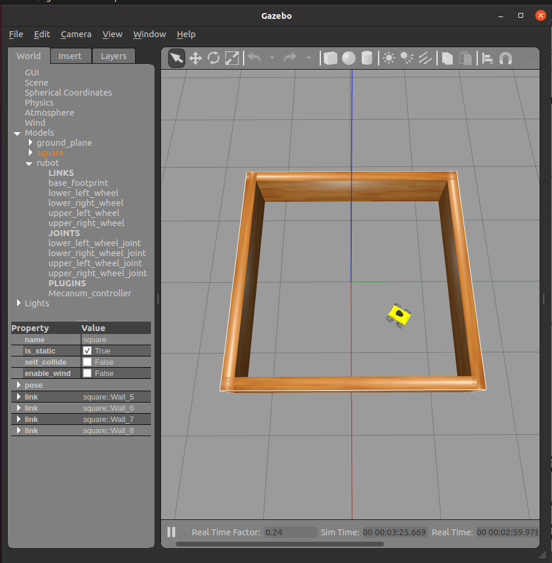
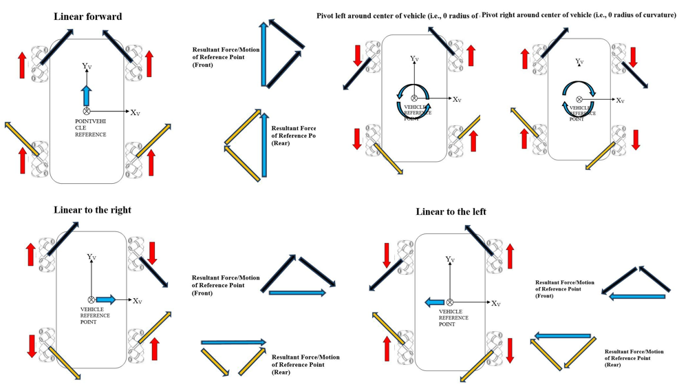
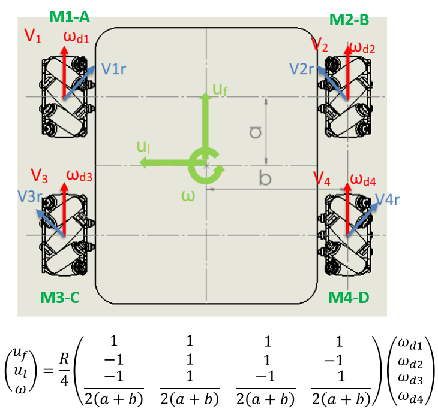
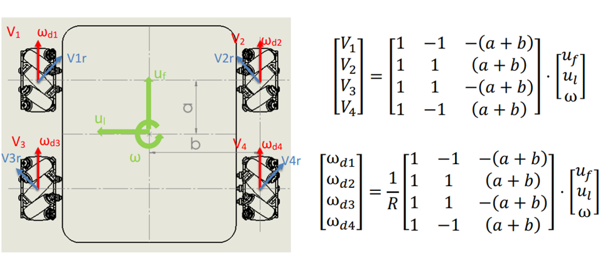
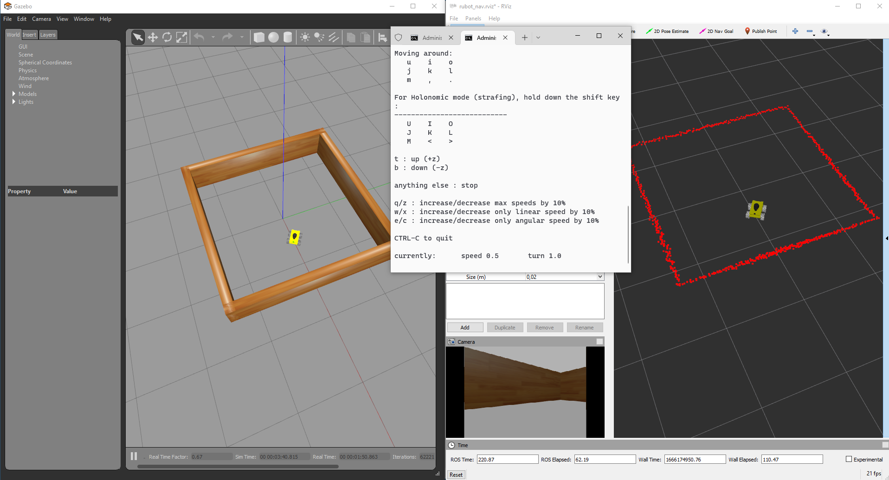
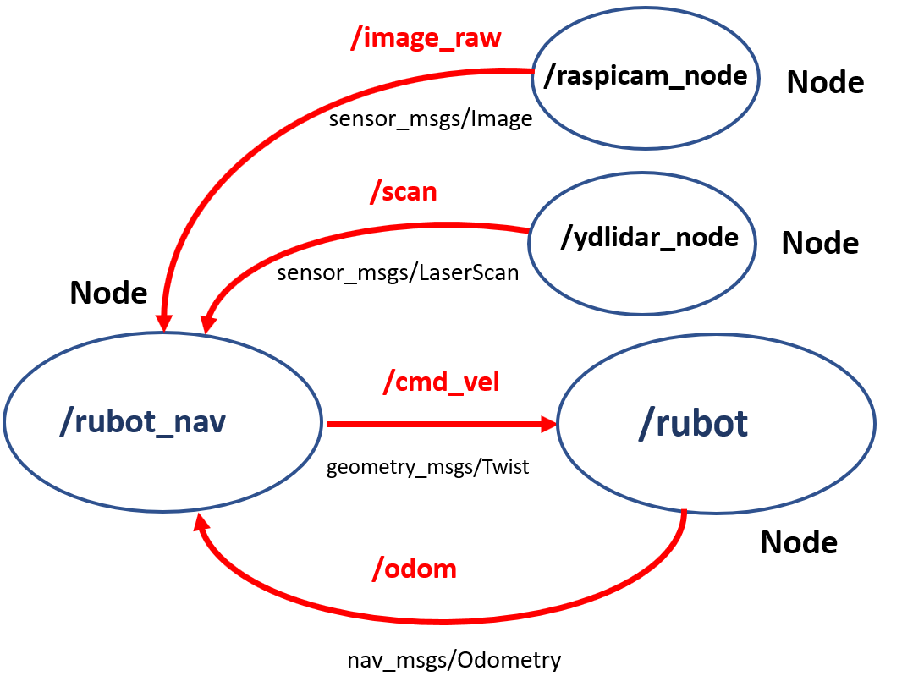
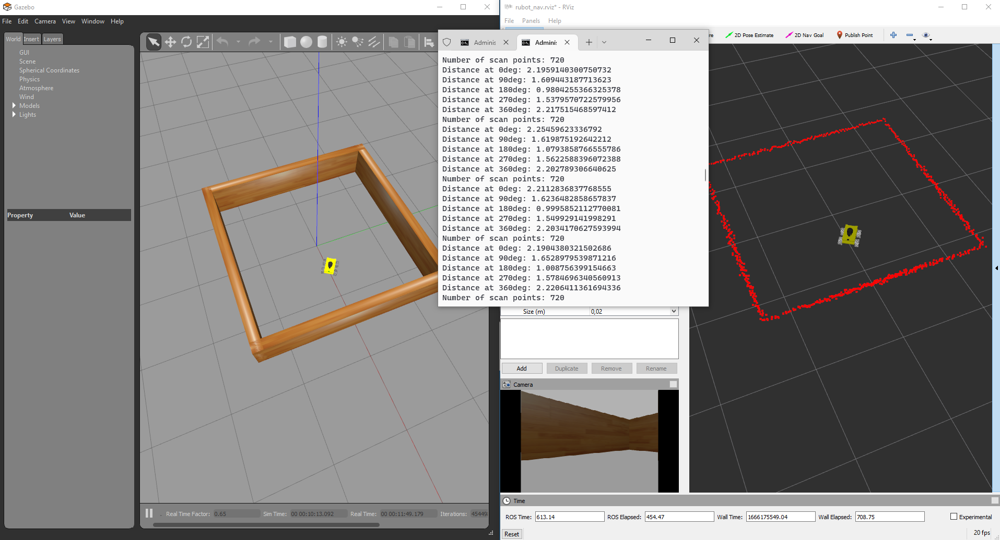
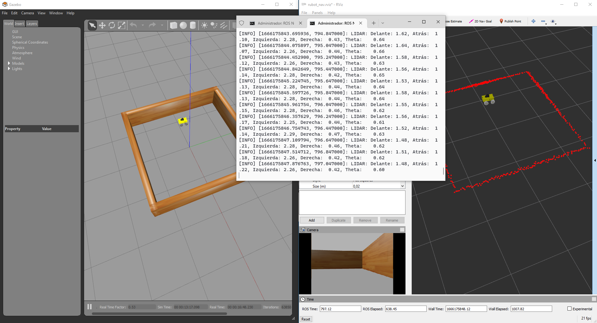
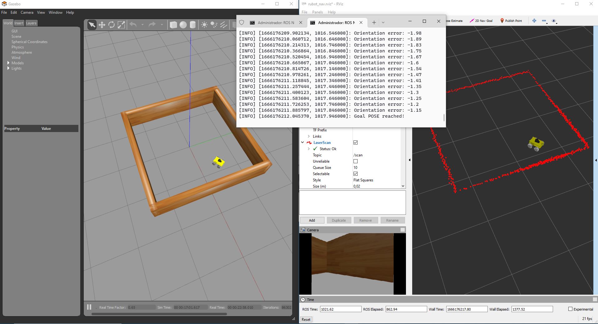

# **rUBot mecanum model & control**

The objectives of this chapter are:
- Create a model of our rUBot 
- use rviz package to view the different topics and nodes
- create a model of the virtual environment
- use gazebo package to simulate the robot kinematics and dynamics
- locate the robot in our created environment
- create our firsts programs to control the robot movement with obstacle avoidance


The final model represents the real rUBot we will use in the laboratory

The rUBot mecanum robot we will work is represented in the picture:


His main characteristics are: 
- Arduino based control for sensors & actuators
  - Servomotor actuators for the 4 mecanum wheels
  
- High-level onboard control with Ubuntu20 and ROS Noetic
  - RPlidar distance sensor
  - Raspicam 2D camera sensor

**Bibliography:**
- https://bitbucket.org/theconstructcore/workspace/projects/PS

## **1. rUBot mecanum model generation**

First of all, we have to create the "rubot_mecanum_description" package where we will create the rUBot model. In case you want to create it from scratch, type:
```shell
cd ~/home/rubot_mecanum_ws/src
catkin_create_pkg rubot_mecanum_description rospy
cd ..
catkin_make
```
Then open the .bashrc file and verify the environment variables and source to the proper workspace:
```shell
source ~/home/rubot_mecanum_ws/devel/setup.bash
```

To create our robot model, we use URDF files (Unified Robot Description Format). URDF file is an XML format file for representing a robot model.(http://wiki.ros.org/urdf/Tutorials)

We have created 2 folders for model description:
- URDF: folder where different URDF models are located. In our case rubot_rp.urdf
- meshes: folder where 3D body models in stl format are located. We will have rubot folder.

The main parts of URDF model are:
- links: diferent bodies/plastic elements
- joints: connection between 2 links 
- sensors & actuators plugins (2D camera, LIDAR and DC motors)

The link definition contains:
- visual properties: the origin, geometry and material
- collision properties: the origin and geomnetry
- inertial properties: the origin, mass and inertia matrix

The joint definition contains:
- joint Type (fixed, continuous)
- parent and child frames
- origin frame
- rotation axis

The geometrical definition of our rUBot is:


In the case or upper left wheel:
```xml
<!-- upper_left_wheel -->
  <joint name="upper_left_wheel_joint" type="continuous">
    <origin rpy="0 0 0" xyz="0.07 0.1 0"/>
    <parent link="base_link"/>
    <child link="upper_left_wheel"/>
    <axis xyz="0 1 0"/>
  </joint>
  <link name="upper_left_wheel">
    <visual>
      <origin rpy="0 0 0" xyz="0 0 0"/>
      <geometry>
        <mesh filename="package://rubot_mecanum_description/meshes/rubot/upper_left_wheel.stl" scale="0.001 0.001 0.001"/>
      </geometry>
      <material name="light_grey"/>
    </visual>
    <collision>
      <origin rpy="-1.57 0 0" xyz="0 0 0"/>
      <geometry>
        <cylinder length="0.03" radius="0.05"/>
      </geometry>
    </collision>
    <inertial>
      <origin rpy="-1.57 0 0" xyz="0.0 0.0 0.0"/>
      <mass value="0.2"/>
      <inertia ixx="0.000166" ixy="0" ixz="0" iyy="0.000303" iyz="0" izz="0.000166"/>
    </inertial>
  </link>
```
> Be careful with base_link:
>
> The inertia matrix can be analytically calculated with the mas and geometry. Be sure the mass is consistent and the inertia Ixx,Iyy and Izz are high enough to avoid underired drift movements. Consider the Inertia matrix you can generate using the **urdf_inertial_calculator.py** program file you have in "Documentation/files/02_Code_Tutorials/URDF_inertial".

The rUBot model includes different sensors and actuators:

Sensors:
- a two-dimensional camera: correspondas to RBPi camera
- a 360º RPLidar A1M8 (https://www.robotshop.com/es/es/rplidar-a1m8-kit-desarrollo-escaner-laser-360-grados.html)

Actuator:
- Mecanum drive actuator: based on 4 DC motors with encoders to obtain the Odometry information

The full model contains also information about the sensor and actuator controllers using specific Gazebo plugins (http://gazebosim.org/tutorials?tut=ros_gzplugins#Tutorial:UsingGazebopluginswithROS). 

Gazebo plugins give your URDF models greater functionality and compatible with ROS messages and service calls for sensor output and motor input. 

These plugins can be referenced through a URDF file, and to insert them in the URDF file, you have to follow the sintax:
### **Camera sensor plugin**
This sensor is integrated as a link and fixed joint for visual purposes. Review the joint and link definition in URDF model.

A driver is needed to view the images.
```xml
  <!-- 2D Camera controller -->
  <gazebo reference="camera">
    <sensor name="camera1" type="camera">
      <update_rate>30.0</update_rate>
      <camera name="front">
        <horizontal_fov>1.3962634</horizontal_fov>
        <image>
          <width>800</width>
          <height>800</height>
          <format>R8G8B8</format>
        </image>
        <clip>
          <near>0.02</near>
          <far>300</far>
        </clip>
      </camera>
      <plugin filename="libgazebo_ros_camera.so" name="camera_controller">
        <alwaysOn>true</alwaysOn>
        <visualize>true</visualize>
        <cameraName>rubot/camera1</cameraName>
        <imageTopicName>image_raw</imageTopicName>
        <cameraInfoTopicName>camera_info</cameraInfoTopicName>
        <frameName>camera</frameName>
        <hackBaseline>0.07</hackBaseline>
        <distortionK1>0.0</distortionK1>
        <distortionK2>0.0</distortionK2>
        <distortionK3>0.0</distortionK3>
        <distortionT1>0.0</distortionT1>
        <distortionT2>0.0</distortionT2>
      </plugin>
    </sensor>
  </gazebo>
  ```
>To view the camera image you can:
> - add the line in the plugin 
> ```xml
><visualize>true</visualize>"
> ```
> -  use rviz
> - type rqt in a terminal and select Plugins->Visualization->Image View
>
>Alternativelly with false in plugin, you can allways call the image typing in a new terminal:
>```shell
>rqt image view
>```

### **LIDAR sensor plugin**
This sensor is integrated as a link and fixed joint for visual purposes. Review the joint and link definition in URDF model.
> Note that rpLIDAR is mounted at 180º and you need to turn the link model and the joint to reflect this in the URDF model.


A driver is needed to see the 720 laser distance points:
```xml
  <!-- Laser Distance Sensor YDLIDAR X4 controller-->
  <gazebo reference="base_scan">
    <sensor name="lds_lfcd_sensor" type="ray">
      <pose>0 0 0 0 0 0</pose>
      <visualize>true</visualize>
      <update_rate>5</update_rate>
      <ray>
        <scan>
          <horizontal>
            <samples>720</samples>
            <resolution>1</resolution>
            <min_angle>0.0</min_angle>
            <max_angle>6.28319</max_angle>
          </horizontal>
        </scan>
        <range>
          <min>0.12</min>
          <max>10</max>
          <resolution>0.015</resolution>
        </range>
        <noise>
          <type>gaussian</type>
          <!-- Noise parameters based on published spec for YDLIDAR X4
              is 1.5% at half range 4m (= 60mm, "+-160mm" accuracy at max. range 8m).
              A mean of 0.0m and stddev of 0.020m will put 99.7% of samples
              within 0.16m of the true reading. -->
          <mean>0.0</mean>
          <stddev>0.02</stddev>
        </noise>
      </ray>
      <plugin filename="libgazebo_ros_laser.so" name="gazebo_ros_lds_lfcd_controller">
        <!-- topicName>/gopigo/scan</topicName -->
        <topicName>scan</topicName>
        <frameName>base_scan</frameName>
      </plugin>
    </sensor>
  </gazebo>
```
>To view the LIDAR rays be sure to add 
> ```xml
><visualize>true</visualize>"
> ```
> or use rviz

It is important to note that:
- the number of points of real RPLidar depends on Lidar model (you will need tot test it first)
- the number of points of simulated Lidar is selected to 720

### **Mecanum drive actuator plugin**
A driver is needed to describe the kinematics.This kinematics is described in the "libgazebo_ros_planar_move.so" file and the URDF model will contain the specific gazebo plugin.

This driver is the "Planar Move Plugin" and is described in Gazebo tutorials: http://gazebosim.org/tutorials?tut=ros_gzplugins#AddingaModelPlugin

```xml
  <!-- Mecanum drive controller -->
  <gazebo>
    <plugin name="Mecanum_controller" filename="libgazebo_ros_planar_move.so">
      <commandTopic>cmd_vel</commandTopic>
      <odometryTopic>odom</odometryTopic>
      <odometryFrame>odom</odometryFrame>
      <odometryRate>50.0</odometryRate>
      <robotBaseFrame>base_footprint</robotBaseFrame>
    </plugin>
  </gazebo>
  ```
In this gazebo plugin, the kinematics of the robot configuration is defined:
- Forward kinematics: obtains the robot velocity (linear and angular in /cmd_vel) and POSE (odometry) for speciffic robot wheel speeds
- Inverse kinematics: obtains the robot wheels speeds for a desired robot velocity (linear and angular in /cmd_vel)

We use a specific "display.launch" launch file where we specify the robot model we want to open in rviz with a configuration specified in "urdf.rviz":
```xml
<launch>
  <param name="robot_description" textfile="$(find rubot_mecanum_description)/urdf/rubot.urdf" />
  <node name="joint_state_publisher" pkg="joint_state_publisher" type="joint_state_publisher" />

  <node name="robot_state_publisher" pkg="robot_state_publisher" type="robot_state_publisher" />
  <node name="rviz" pkg="rviz" type="rviz" args="-d $(find rubot_mecanum_description)/rviz/urdf_final.rviz" />
</launch>
```
Launch the ROS visualization tool to check that the model is properly built. 
RViz only represents the robot visual features. You have available all the options to check every aspect of the appearance of the model
```shell
roslaunch rubot_mecanum_description display.launch
```


> Colors in rviz: 
>- are defined at the beginning
>- Ensure the "visual" link properties have no "name"
```xml
<robot name="rubot">
  <material name="yellow">
    <color rgba="0.8 0.8 0.0 1.0"/>
  </material>

  ...

    <link name="base_link">
    <visual>
      <origin rpy="0 0 0" xyz="0 0 0"/>
      <geometry>
        <mesh filename="package://rubot_mecanum_description/meshes/rubot/base_link.stl" scale="0.001 0.001 0.001"/>
      </geometry>
      <material name="yellow"/>
    </visual>
```
In robotics research, always before working with a real robot, we simulate the robot behaviour in a virtual environment close to the real one.

Gazebo is an open source 3D robotics simulator and includes an ODE physics engine and OpenGL rendering, and supports code integration for closed-loop control in robot drives. This is sensor simulation and actuator control.

We will create a new spawn.launch file to spawn the robot in an empty world:
```xml
<launch>
  <!-- Define the needed parameters -->
  <arg name="model" default="rubot.urdf" />

  <include file="$(find gazebo_ros)/launch/empty_world.launch"/>
  <!-- Spawn the robot -->
  <!-- Robot URDF definition -->
    <param name="robot_description" textfile="$(find rubot_mecanum_description)/urdf/$(arg model)"/>
  <node name="spawn_model" pkg="gazebo_ros" type="spawn_model"
    args="-urdf -model rUBot -param robot_description"/>
</launch>
```
Open a new terminal and launch this file:
```shell
roslaunch rubot_mecanum_description rubot_gazebo.launch
```


You will see in Rviz the camera is receiving now images!
> Colors in gazebo: 
>- are defined at the end of urdf file:
```xml
<!-- Gazebo colors have to be specified here with predefined Gazebo colors -->
  <gazebo reference="base_link">
    <material>Gazebo/Yellow</material>
  </gazebo>
```
You can create a very simple world "rubot.world" using gazebo:

- Close first gazebo process in a new terminal
  ```shell
  pkill gzserver && pkill gzclient
  ```
- Type: sudo gazebo
- add some objects in the empty world
- save the final world to "worlds" folder
- quit in gazebo application

The robot could be spawn in a predefined position and orientation inside this new created world using this new rubot_world.launch file.

Type the following to spawn the robot inside the world and test the sensor values using rviz:
```shell
roslaunch rubot_mecanum_description rubot_world.launch
roslaunch rubot_mecanum_description display.launch
```


You can see the nodes and topics generated using rqt_graph


> To see the frames you have to add TF in rviz

>Carefull:
- Perhaps is needed to setup your Keys again:
  ```shell
  curl -s https://raw.githubusercontent.com/ros/rosdistro/master/ros.asc | sudo apt-key add -
  sudo apt get update
  sudo apt get upgrade
  ```

**Activity:**

Design a proper model corresponding to the real rUBot_mecanum you will work with:
- Customized model colors (rviz and gazebo)
- Add a number part on top with a fixed joint

To verify the final frame orientations (modify the launch files accordingly):
```shell
roslaunch rubot_mecanum_description rubot_world.launch
roslaunch rubot_mecanum_description display.launch
```


## **2. Design the project world**

Here we have first to design the project world, for exemple a maze from where our rUBot mecanum has to navigate autonomously.

There is a very useful and simple tool to design a proper world: "Building editor" in gazebo.

Open gazebo as superuser:
```shell
sudo gazebo
```

You can build your world using "Building Editor" in Edit menu


You can save:
- the generated model in a model folder (without extension)

Close the Builder Editor, modify the model position and add other elements if needed. Save:
- the generated world (with extension .world) in the world folder.

Once you finish is better to close the terminal you have work as superuser

#### ***Modify a created world***
- Open a terminal where you have the world you want to modify
- type: sudo gazebo ./maze1.world
- make modifications
- save your world in a Desktop directory
- close gazebo and the terminal
#### **Create world with model parts**
You can create model parts like walls of 90cm or 60cm with a geometry and color, using building editor. These parts can be saved:
- in ~/.gazebo/models/
- in speciffic folder in your package (i.e. rubot_mecanum_ws/src/rubot_mecanum_description/models), if you add this line in .bashrc file:
  ```xml
  export GAZEBO_MODEL_PATH=/media/sf_github_manelpuig/rubot_mecanum_ws/src/rubot_mecanum_description/models:$GAZEBO_MODEL_PATH
  ```
- When a model is created with "Building Editor", this path is saved in gazebo environment and you can use it in the future.

You will have acces in gazebo insert section. Then you can construct your world adding parts.

This is an exemple:


### **Bringup the rUBot in project world**

Now, spawn the rUBot mecanum robot in our generated world. You have to modify the world argument in "rubot_world.launch" file:
``` shell
roslaunch rubot_mecanum_description rubot_world.launch
```


## **3. rUBot mecanum navigation control in the new world environment**

Once the world has been generated we will create a ROS Package "rubot_control" to perform the autonomous navigation
```shell
cd ~/rubot_mecanum_ws/src
catkin_create_pkg rubot_control rospy std_msgs sensor_msgs geometry_msgs nav_msgs
cd ..
catkin_make
```

### **3.1 Kinematics model of mecanum robot**
The first concept we are going to go through is kinematic models. So, we know what kinematics are, but, what is a kinematic model?

Wheeled mobile robots may be classified in two major categories, holonomic (omnidirectional) and nonholonomic. 
- Nonholonomic mobile robots, such as conventional cars, employ conventional wheels, which prevents cars from moving directly sideways.
- Holonomic mobile robots, such as mecanum cars, employ omni or mecanum wheels, which allow lateral and diagonal movements

We will define the Kinematic model for Holonomic Mecanum wheeled robot:

Omnidirectional wheeled mobile robots typically employ either omniwheels or mecanum wheels, which are typical wheels augmented with rollers on their outer circumference. These rollers spin freely and they allow sideways sliding while the wheel drives forward or backward without slip in that direction.

The different movements our car can perform are:


The forces involved define the robot linear and angular movement:


The forward Kinematic's equations are defined below:


where

- Vi: Linear speed of the wheels.
- ωdi: Angular speed of the wheels.
- Vir: Tangential speed of the rollers.
- ul: Linear velocity of the system on the X axis.
- uf: Linear velocity of the system on the Y axis.
- ω: Speed of rotation of the system on the Z axis.
- a: Distance from the center of the robot to the axis of rotation of the wheel.
- b: Distance from the center of the robot to the center of the width of the wheel.

>(see [Lynch & Park, 2017] for a complete derivation of this model).

In our case we want to apply a robot movement defined by:
- a linear and angular velocity using a Twist message type published in a /cmd_vel topic. 
- we need to calculate the 4 wheel speeds needed to obtain this robot velocity

This corresponds to an Inverse Kinematics defined by the following expressions:

With the information of (uf,ul,w) Gazebo plugin calculates to obtain the Odometry.
The analytical expressions are explained graphically in the picture:


In the case of real mecanum robot this is calculated by the robot driver as an arduino program in arduino-mega platform.

### **3.2. Mecanum control in a world environment**
We can control the movement of our robot using:
- the keyboard or a joypad
- pragramatically in python creating a "/rubot_nav" node


We are now ready to launch control actions

#### **3.2.1. Keyboard control**
You can control the rUBot with the keyboard installing the following packages:
```shell
sudo apt-get install ros-noetic-teleop-tools
sudo apt-get install ros-noetic-teleop-twist-keyboard
```
In ROS for windows, you need to make a source installation of this 2 packages. Follow the instructions in Documentation/Files folder to install source packages.

Then you will be able to control the robot with the Keyboard typing:
```shell
rosrun key_teleop key_teleop.py /key_vel:=/cmd_vel
or
rosrun teleop_twist_keyboard teleop_twist_keyboard.py
```

#### **3.2.2. Python programming control**
Diferent navigation programs are created:

- Navigation control: to define a desired robot velocity
- Lidar test: to verify the LIDAR readings and angles
- Autonomous navigation: to perform a simple algorithm for navigation with obstacle avoidance using the LIDAR
- Wall follower: at a fixed distance to perform a good map
- go to POSE: attend a specific position and orientation

The nodes and topics structure corresponds to the following picture:


#### **a) Navigation Control**

We will create now a first navigation python files in "src" folder:
- rubot_nav.py: to define a rubot movement with linear and angular speed during a time td

Specific launch file have been created to launch the node and python file created above:
```shell
roslaunch rubot_control rubot_nav.launch
```

#### **b) LIDAR test**

In order to navigate autonomously and avoid obstacles, we will use a specific rpLIDAR sensor.
To verify the LIDAR readings and angles we have generated the "rubot_lidar_test.py" python file:
```python
#! /usr/bin/env python3
import rospy
from sensor_msgs.msg import LaserScan
def callback(msg):
    print ("Number of scan points: "+ str(len(msg.ranges)))
    # values at 0 degrees
    print ("Distance at 0deg: " + str(msg.ranges[0]))
    # values at 90 degrees
    print ("Distance at 90deg: " + str(msg.ranges[180]))
    # values at 180 degrees
    print ("Distance at 180deg: " + str(msg.ranges[360]))
    # values at 270 degrees
    print ("Distance at 270deg: " + str(msg.ranges[540]))
    # values at 360 degrees
    print ("Distance at 360deg: " + str(msg.ranges[719]))
rospy.init_node('scan_values')
sub = rospy.Subscriber('/scan', LaserScan, callback)
rospy.spin()
```
To test the LIDAR we have generated a launch file
```shell
roslaunch rubot_control rubot_lidar_test.launch
rosrun teleop_twist_keyboard teleop_twist_keyboard.py
```

> We can see that the zero angle corresponds to the back side of the robot!

#### **c) Autonomous navigation with obstacle avoidance**
We will use now the created world to test the autonomous navigation with obstacle avoidance performance. 

We have to launch the "rubot_self_nav.launch" file in the "rubot_control" package.
```shell
roslaunch rubot_control rubot_self_nav.launch
```
>Careful:
- we have included in launch file: gazebo spawn, rviz visualization and rubot_nav node execution 
- Verify in rviz you have to change the fixed frame to "odom" frame


The algorithm description functionality is:
- "rubot_self_nav.py": The Python script makes the robot go forward. 
    - LIDAR is allways searching the closest distance and the angle
    - when this distance is lower than a threshold, the robot goes backward with angular speed in the oposite direction of the minimum distance angle.

> Note the 180 degrees turn due to the rpLIDAR orientation in rUBot:
```python
    def callbackLaser(self, scan):

        closestDistance, elementIndex = min(
            (val, idx) for (idx, val) in enumerate(scan.ranges) if scan.range_min < val < scan.range_max
        )
        angleClosestDistance = self.__wrapAngle((elementIndex / 2)-180) # RPLidar zero angle in backside

        rospy.loginfo("Closest distance of %5.2f m at %5.1f degrees.",
                      closestDistance, angleClosestDistance)
```

#### **d) Wall Follower**
Follow the wall accuratelly is an interesting challenge to make a map with precision to apply SLAM techniques for navigation purposes.

There are 2 main tasks:
- Create a python file "rubot_wall_follower.py" to perform the wall follower in the maze of our gopigo3 robot
- Create a launch file to initialyse all the needed nodes in our system for this control task

We have developed 2 different methods for wall follower:
- Geometrical method
- Lidar ranges method

#### **Geometrical method**

Follow the instructions to perform the rubot_wall_follower_gm.py python program are in the notebook: 
https://github.com/Albert-Alvarez/ros-gopigo3/blob/lab-sessions/develop/ROS%20con%20GoPiGo3%20-%20S4.md

The algorithm is based on:


A rubot_wall_follower_gm.launch is generated to test the node within a specified world
```shell
roslaunch rubot_control rubot_wall_follower_gm.launch
```

You can see a video for the Maze wall follower process in: 
[](https://youtu.be/z5sAyiFs-RU)


#### **Lidar ranges method**

We have created another rubot_wall_follower_rg.py file based on the reading distances from LIDAR in the ranges: front, front-right, front-left, right, left, back-right and back-left, and perform a specific actuation in function of the minimum distance readings.

Follow the instructions to create the rubot_wall_follower_rg.py python file: https://www.theconstructsim.com/wall-follower-algorithm/


The algorith is based on laser ranges test and depends on the LIDAR type:


```shell
roslaunch rubot_control rubot_wall_follower_rg.launch
```


#### **Go to POSE**
Define a specific Position and Orientation as a target point to go:

- x target point
- y target point
- f yaw orientation angle in deg

Modify the python script developed in turlesim control package according to the odom message type

For validation type:
```shell
roslaunch rubot_control rubot_go2pose.launch
```
