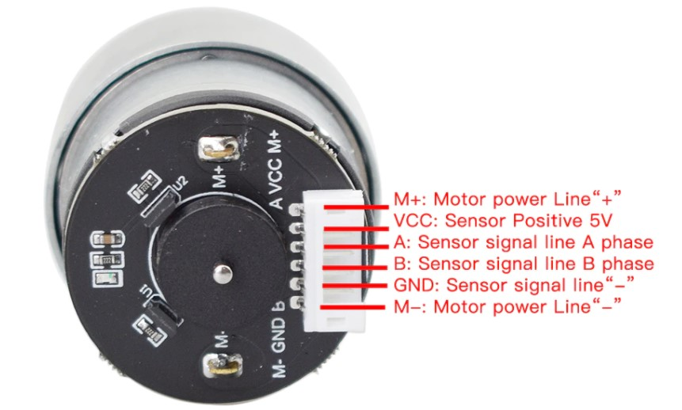

# **rUBot Mecanum Hardware bringup**
The hardware bringup file will contain:
- launch the rUBot node in Arduino-Mega board
- launch the LIDAR node
- launch the raspicam node

Graphically, the final node structure will be:


The bringup launch file will prepare the rUBot to comunicate with /rUBot_nav node for specific control actions.

## **1. Launch rUBot node**

To bringup we need to run the driver designed for rubot_mecanum robot. The driver is in fact an arduino program that controls:

- The kinematics of the 4 mecanum wheels to apply the twist message in /cmd_vel topic
- The encoders to obtain the odometry
- Read the IMU orientation values
- interface with all the other sensors/actuators connected to arduino-mega board

The "rubot_mecanum.ino" arduino program is located on /Documentation/files/arduino/ folder

>Carefull!:
>
>You need to install Encoder.h lib: https://www.arduino.cc/reference/en/libraries/encoder/

This final code contains:
- Subscriber to /cmd_vel topic 
- Publisher to /odom topic
- Publisher to /imu topic

>Take care about:
>- Motor connections



>- Shield schematics


>- Pin number of encoders, PWM and DIR in config.h and encoder.h files


>- Kinematics expressions in kinematics.hpp library according to:

The kinematics.hpp has to include the correct expressions:
```python
//wABCD m/s
void InverseKinematic(float vx,float vy,float omega, float &pwmA,float &pwmB,float &pwmC,float &pwmD){
  pwmA=speed2pwm((vx-vy-K*omega)); 
  pwmB=speed2pwm(vx+vy+K*omega); 
  pwmC=speed2pwm(vx+vy-K*omega);
  pwmD=speed2pwm(vx-vy+K*omega); 
```
The final code will be:

```python

#include <ros.h>
#include <ros/time.h>
#include <tf/tf.h>
#include <tf/transform_broadcaster.h>
#include <geometry_msgs/Twist.h>
#include <nav_msgs/Odometry.h>
#include<std_msgs/Bool.h>
//#include <WinsenZE03.h>
//WinsenZE03 sensor;  // sensor de ozo
#include"encoder.h"
#include"kinematics.hpp"
#include"motor.h"
#include"pid.hpp"
#include"imu.hpp"

//#define HDW_DEBUG  //aquesta opcio es per provar que envia correctament pel port serie les dades de la IMU i dels encodes, despres s'ha de desactivar  amb //

#if !defined(HDW_DEBUG)
ros::NodeHandle nh;
//ros::NodeHandle_<ArduinoHardware, 5, 5, 512, 1024> nh;
//ros::NodeHandle_<ArduinoHardware, 5, 5, 1024, 1024, FlashReadOutBuffer_> nh;
tf::TransformBroadcaster broadcaster;


#endif

float ctrlrate=1.0;
unsigned long lastctrl;
geometry_msgs::TransformStamped t;
geometry_msgs::Twist twist;
nav_msgs::Odometry odom;
ros::Publisher odom_pub("odom", &odom);

double x=0,y=0,theta=0;


float KP=0.3,KI=0.2,KD=0.2;
MPID PIDA(encA,KP,KI,KD,true);
MPID PIDB(encB,KP,KI,KD,false);
MPID PIDC(encC,KP,KI,KD,true);
MPID PIDD(encD,KP,KI,KD,false);

float wA,wB,wC,wD;

BMX055 Imu;

#if !defined(HDW_DEBUG)
void cmdVelCb( const geometry_msgs::Twist& twist_msg){
  float vx=twist_msg.linear.x;
  float vy=twist_msg.linear.y;
  float w=twist_msg.angular.z;

  float pwma=0,pwmb=0,pwmc=0,pwmd=0;
  InverseKinematic(vx,vy,w,pwma,pwmb,pwmc,pwmd);
  PIDA.tic();
  MotorA(PIDA.getPWM(pwma));
  wA=PIDA.getWheelRotatialSpeed();
  PIDA.toc();

  PIDB.tic();
  MotorB(PIDB.getPWM(pwmb));
  wB=PIDB.getWheelRotatialSpeed();
  PIDB.toc();

  PIDC.tic();
  MotorC(PIDC.getPWM(pwmc));
  wC=PIDC.getWheelRotatialSpeed();
  PIDC.toc();

  PIDD.tic();
  MotorD(PIDD.getPWM(pwmd));
  wD=PIDD.getWheelRotatialSpeed();
  PIDD.toc();

  lastctrl=millis();
}

void resetCb(const std_msgs::Bool& reset){
  if(reset.data){
    x=0.0;y=0.0;theta=0.0;
  }else{
    
  }
}

ros::Subscriber<geometry_msgs::Twist> sub("cmd_vel", cmdVelCb );
ros::Subscriber<std_msgs::Bool> resub("rest_odom", resetCb );
#endif

void setup()
{
  #if defined(HDW_DEBUG)
	Serial.begin(57600);
  
  pinMode (2,OUTPUT);
  pinMode (3,OUTPUT);
  pinMode (4,OUTPUT);
  pinMode (5,OUTPUT);
 digitalWrite(2, HIGH);
 digitalWrite(3, LOW);
 digitalWrite(4, LOW);
 digitalWrite(5, LOW);

 
  Serial3.begin(9600);
  //sensor.begin(&Serial3, CO);
  //sensor.setAs(QA);
 #endif
	IO_init();
  PIDA.init();
  PIDB.init();
  PIDC.init();
  PIDD.init();
//  Imu.SetupDevice();
  #if !defined(HDW_DEBUG)
  nh.initNode();
  broadcaster.init(nh);
  nh.subscribe(sub);
  nh.subscribe(resub);
  nh.advertise(odom_pub);
  lastctrl=millis();
  #endif
}

void loop(){
  float ax,ay,az,gx,gy,gz;
  delay(10);

  float vxi=0,vyi=0,omegai=0;
  ForwardKinematic(wA,wB,wC,wD,vxi,vyi,omegai);
  //float ppm = sensor.readManual();
  float dt=PIDA.getDeltaT();
  x+=vxi*cos(theta)*dt-vyi*sin(theta)*dt;
  y+=vxi*sin(theta)*dt+vyi*cos(theta)*dt;
  theta+=omegai*dt;
  if(theta > 3.14)
    theta=-3.14;
//                        TODO IMU
 Imu.getGyro(gx,gy,gz);
Imu.getAcc(ax,ay,az);
#if defined(HDW_DEBUG)
Serial.print("ACC:  x: ");
Serial.print(ax);
Serial.print(" y: ");
Serial.print(ay);
Serial.print(" z: ");
Serial.println(az);

Serial.print("GRYO:  x: ");
Serial.print(gx);
Serial.print(" y: ");
Serial.print(gy);
Serial.print(" z: ");
Serial.println(gz);

#endif

  #if !defined(HDW_DEBUG)

 t.header.frame_id = "odom";
 t.child_frame_id = "base_link";
  
  t.transform.translation.x = x;
  t.transform.translation.y = y;
  
  t.transform.rotation = tf::createQuaternionFromYaw(theta);
  t.header.stamp = nh.now();
  
  broadcaster.sendTransform(t);

  
  odom.header.stamp = nh.now();;
  odom.header.frame_id = "odom";
  odom.pose.pose.position.x = x;
  odom.pose.pose.position.y = y;
  odom.pose.pose.position.z = 0.0;
  odom.pose.pose.orientation =tf::createQuaternionFromYaw(theta);;

  odom.child_frame_id = "base_link";
  //odom.twist.twist.linear.x = vxi;
  //odom.twist.twist.linear.y = vyi;
  //odom.twist.twist.angular.z = omegai;

  odom_pub.publish(&odom);


  if((millis()-lastctrl)>1000*ctrlrate){
    STOP();
  }
  nh.spinOnce();
  #endif
 
}
```
> Important modification!:
> - We need to increase the buffer size of /odom publisher because the Arduino MEGA Buffer size for messages is 512bits (not enough for Odometry messages). To perform this modification, in ROS.h file from the Arduino library you have to add (at the end in else case section):
  ```python
  #else

    //typedef NodeHandle_<ArduinoHardware, 25, 25, 512, 512, FlashReadOutBuffer_> NodeHandle;
    typedef NodeHandle_<ArduinoHardware, 5, 5, 1024, 1024, FlashReadOutBuffer_> NodeHandle;

  #endif  
  ```

>- When you want to test the program in ROS, you need to close the arduino IDE to make available the USB connection

To test your rubot_mecanum arduino program you need to:
- open arduino IDE
- upload the rubot_mecanum.ino file
- Open 3 new terminals and type:
```shell
roscore
rosrun rosserial_python serial_node.py _port:=/dev/arduino _baud:=57600
rostopic pub -r 10 /cmd_vel geometry_msgs/Twist '[0.5, 0, 0]' '[0, 0, 0]'
```
> /dev/arduino is the port to which the Arduino is connected, change it in case yours is different

> The last command sends a Twist message to the robot. The wheels should be moving forward. You can try different movements by modifying the numbers inside the brackets: '[vx, vy, vz]' '[wx, wy, wz]', you should only change vx, vy and wz values as the others do not apply. As it is an holonomic robot, if all the values are 0.0 except for wz (angular velocity in z axis) you will obtain a movement in which the robot spins on itself.

## **2. Launch LIDAR node**

To launch the rpLIDAR sensor, connect the LIDAR sensor to RaspberryPi and execute:
```shell
roslaunch rplidar_ros rplidar.launch
```
## **3. Launch raspicam node**

To launch the raspicam sensor, execute:
```shell
roslaunch raspicam_node camerav2_410x308_30fps.launch enable_raw:=true camera_frame_id:="laser_frame"
```
> Change the launch file for image resolution and frame rate:
**Modificacio Sergio!**

## **Final bringup launch file**

We will create a "rubot_bringup.launch" file to setup the rUBot_mecanum.

```xml
<launch>
    <arg name="model" default="rubot.urdf" />
  <!-- spawn nexus -->
    <param name="robot_description" textfile="$(find rubot_mecanum_description)/urdf/$(arg model)" />
  <!-- send joint values -->
    <node name="joint_state_publisher" pkg="joint_state_publisher" type="joint_state_publisher">
      <param name="use_gui" value="False"/>
    </node>
  <!-- Combine joint values -->
    <node name="robot_state_publisher" pkg="robot_state_publisher" type="robot_state_publisher"/>
  <!-- Show in Rviz   -->
    <node name="rviz" pkg="rviz" type="rviz"  args="-d $(find rubot_control)/rviz/rubot_nav.rviz"/>
  <!-- launch rUBot mecanum   -->
    <node name="serial_node" pkg="rosserial_python" type="serial_node.py">
      <param name="port" type="string" value="/dev/ttyACM0"/>
      <param name="baud" type="int" value="57600"/>
    </node>
  <!-- launch ydlidar   -->
    <include file="$(find rplidar_ros)/launch/rplidar.launch"/>
  <!-- launch raspicam   -->
    <include file="$(find raspicam_node)/launch/camerav2_1280x960_10fps.launch">
    <arg name="enable_raw" value="true"/>
    <arg name="camera_frame_id" value="base_scan"/>
    </include>
</launch>
```
To launch the bringup file type:
```shell
roslaunch rubot_control rubot_bringup_hw.launch
```
